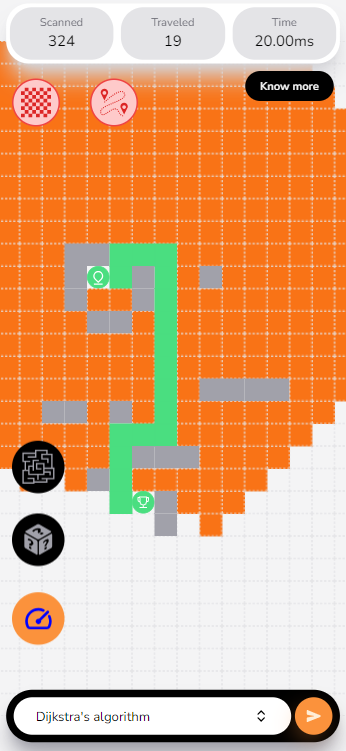
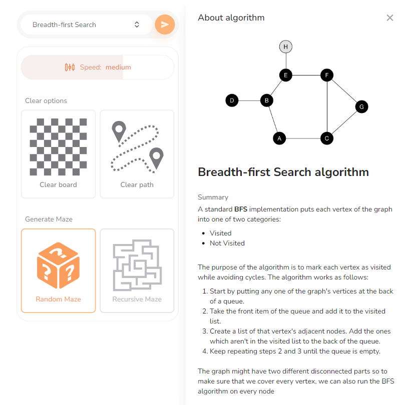

#### Path Finding Visualizer: Explore Algorithms in Action!

##### Project Overview

Fascinated by pathfinding and how algorithms tackle navigation problems? This interactive web application brings Dijkstra's, Depth-First Search (DFS), and Breadth-First Search (BFS) algorithms to life in a visually engaging way. Experiment with customizable grids, visualize the algorithms' inner workings, and unlock the magic of pathfinding, whether you're a seasoned developer, a curious student, or simply intrigued by problem-solving.

|  |  |
| -------------------------------------- | -------------------------------------- |
|  |  |

##### Why You'll Love This Visualizer:

- _Interactive Playground:_ Craft your own pathfinding challenges. Define obstacles, set start and end points, and adjust grid size to experiment with different scenarios.
- _Algorithm Showcase:_ Witness the inner workings of Dijkstra's, DFS, and BFS algorithms firsthand. See how they explore the grid, evaluate options, and ultimately guide you to the solution.
- _Engaging Visualization:_ Clear color-coding and animations highlight explored nodes, path sections, obstacles, and more, making the process dynamic and easy to understand.
- _Simple Navigation:_ Intuitive controls and a user-friendly interface ensure you spend less time learning the tool and more time exploring pathfinding magic.

##### Dive into the Tech Stack:

- **ReactJS:** Powers the dynamic and interactive user interface, allowing for smooth interactions and visual updates.
- **JavaScript/Typescript:** Implements the core pathfinding algorithms and grid logic, bringing the theoretical concepts to life.
- **Tailwind CSS:** Provides a clean and responsive layout through its utility-first approach, ensuring the app looks great on any device.

##### Get Started in Seconds:

- Clone the Repository:

```Bash
git clone https://github.com/Abhishek-k-git/Path-Finding-Visualizer.git
```

- Install Dependencies:

```Bash
cd path-finding-visualizer
npm install
```

- Start the Development Server:

```Bash
npm start
```

Explore! Head over to http://localhost:3000 in your browser to unleash your pathfinding adventures.

##### How to Use:

- _Craft Your Maze:_ Click on grid cells to place obstacles, creating a unique challenge for the algorithms.
- _Define the Goal:_ Choose starting and ending points using the "Set Start" and "Set End" buttons.
- _Pick Your Algorithm:_ Select the pathfinding algorithm you want to witness from the dropdown menu.
- _Let the Exploration Begin:_ Click "Run" and watch as the chosen algorithm navigates the grid, finding the optimal path to your destination.

##### Pseudocode for Algorithms (Please note that these are simplified representations and may vary depending on specific implementation details)

**Dijkstra's Algorithm:**

```bash
1. function Dijkstra(graph, source):
2.    dist = Array(graph.numVertices).fill(Infinity)
3.    dist[source] = 0
4.    prev = Array(graph.numVertices).fill(null)
5.    pq = new PriorityQueue()
6.
7.    for (let v = 0; v < graph.numVertices; v++) {
8.       pq.enqueue(v, Infinity)
9.    }
10.   pq.decreaseKey(source, 0)
11.
12.   while (!pq.isEmpty()) {
13.      u = pq.dequeue()
14.
15.      for (let neighbor of graph.getNeighbors(u)) {
16.         if (pq.inQueue(neighbor)) {
17.             alt = dist[u] + graph.getEdgeWeight(u, neighbor)
18.             if (alt < dist[neighbor]) {
19.                 dist[neighbor] = alt
20.                 prev[neighbor] = u
21.                 pq.decreaseKey(neighbor, alt)
22.             }
23.         }
24.      }
25.   }
26.
27.   return dist
```

- Explanation:

  - Initialization: The dist array is filled with infinity, and the priority queue pq is created. All vertices are added to the queue with initial infinite distances. The source node's priority is updated to 0, making it the first to be processed.
  - Main Loop: The loop continues as long as pq is not empty.
  - Minimum Distance Vertex: The vertex u with the minimum dist value is extracted from pq.
  - Neighbor Exploration: The neighbors of u are iterated through.
  - Distance Update: If a neighbor neighbor is still in pq and a shorter tentative distance alt is found, dist[neighbor] and prev[neighbor] are updated, and the neighbor's priority in pq is decreased to reflect the new distance.

**Depth-First Search (DFS):**

```bash
1. function DFS(graph, start):
2.    visited = new Set()
3.
4.    function dfsRecursive(node) {
5.       visited.add(node)
6.       for (let neighbor of graph.getNeighbors(node)) {
7.           if (!visited.has(neighbor)) {
8.               dfsRecursive(neighbor)
9.           }
10.      }
11.   }
12.
13.  dfsRecursive(start)
```

- Explanation:

  - visited Set: A set is used to keep track of visited nodes, preventing infinite loops in case of cycles.
  - dfsRecursive Function: This recursive function explores the graph starting from the current node.
  - Mark Node as Visited: The current node is added to the visited set.
  - Explore Unvisited Neighbors: The function iterates through the neighbors of the current node.
  - Recursive Call: If a neighbor is not yet visited, the dfsRecursive function is called recursively for that neighbor, continuing the depth-first exploration.

**Breadth-First Search (BFS):**

```bash
1. function BFS(graph, start):
2.    visited = new Set()
3.    queue = new Queue()
4.    visited.add(start)
5.    queue.enqueue(start)
6.
7.    while (!queue.isEmpty()) {
8.       currentNode = queue.dequeue()
9.
10.      for (let neighbor of graph.getNeighbors(currentNode)) {
11.         if (!visited.has(neighbor)) {
12.            visited.add(neighbor)
13.            queue.enqueue(neighbor)
14.         }
15.      }
16.   }
```

- Explanation:
  - visited Set: Similar to DFS, a set is used to track visited nodes.
  - queue Data Structure: A queue (FIFO - First-In-First-Out) is used to ensure that nodes are explored in a breadth-first manner.
  - Initialization: The starting node is marked as visited and added to the queue.
  - Main Loop: The loop continues as long as the queue is not empty.
  - Dequeue Current Node: The first node in the queue (the one closest to the starting node) is dequeued and processed.
  - Explore Unvisited Neighbors: The neighbors of the current node are iterated through.
  - Mark and Enqueue Neighbors: If a neighbor is not yet visited, it's marked as visited and added to the back of the queue, ensuring those closer to the starting node are explored first.
